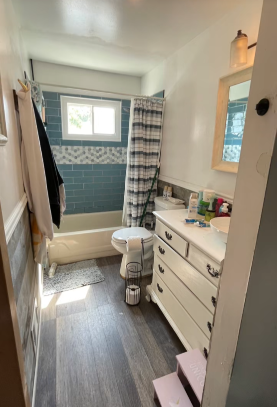
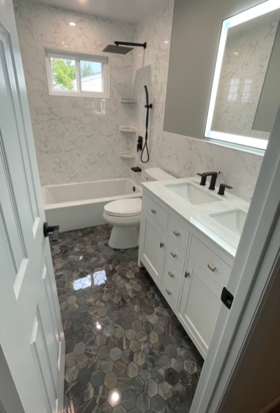

# Upgrade — how to drop it into the live site

Two new files go next to `index.html`:

- `upgrade.css`
- `upgrade.js`

## 1. In the `<head>` of every page

Add the new stylesheet **after** `style.css`:

```html
<link rel="stylesheet" href="style.css">
<link rel="stylesheet" href="upgrade.css">
```

No new fonts — type stays on your original Sora / Canela stacks.
Nothing in `style.css` needs to change — `upgrade.css` only overrides.

## 2. Before `</body>` on showcase.html (and the home page if you add sliders there)

```html
<script src="upgrade.js"></script>
```

Then delete the `.wrapper` / `.scroller` block at the top of `script.js` (lines 1–50). The
old before/after code is replaced.

## 3. Before / After markup

Replace each `.wrapper` block with:

```html
<figure class="ba">
  
  
  <span class="ba-tag ba-tag-after">After</span>
  <span class="ba-tag ba-tag-before">Before</span>
  <input class="ba-range" type="range" min="0" max="100" value="50" step="0.1"
         aria-label="Reveal the after photo">
  <div class="ba-divider">
    <div class="ba-handle">
      <i class="fa-solid fa-chevron-left"></i><i class="fa-solid fa-chevron-right"></i>
    </div>
  </div>
</figure>
```

Wrap the set in `<div class="ba-grid-2">` (replaces `.ba-grid`) and use `.ba-section` /
`.ba-head` for the heading block.

Why it behaves better: the drag surface is a real range input covering the whole image, so
you can grab anywhere, tap to jump straight to a position, drag on touch without the page
scrolling sideways, and nudge with arrow keys. The old version only responded to the small
circle and lost the drag on fast movements.

## 4. Navbar

Markup is unchanged except:
- phone number is now a `tel:` link (`<a href="tel:19178613247">`)
- add `class="nav-link active"` to the link for the current page
- the logo links to `index.html` (in both the navbar and the footer)

Header text turns black (#1A2130) as soon as the bar goes light on scroll, so it never
gets lost against the page.

## 5. Footer

Swap the whole `<footer class="footer py-5">…</footer>` for the `footer-v2` block in
`Home v2.dc.html`. It is the same information, reorganised into four columns with the
phone number as the visual anchor, a quote button, and a bottom bar for copyright.

## 6. Things to confirm before publishing

The trust bar makes four claims. Check each is accurate and edit the text if not:

- Licensed & Insured — NY & NJ
- In Business Since 2022 — Family owned
- Free Consultations — No obligation
- Interior & Exterior — One crew, whole project

If you have a license number, put it in the footer bottom bar; it is the single strongest
credibility signal on a contractor site.

The three testimonial cards on the home page are empty placeholders. Send me real review
text (or a link to your Google/Instagram reviews) and I will drop them in — I did not
write any so nothing false ships.


## 7. Pages in the clickable prototype

Every page is now built and linked, so you can click straight through:

| Prototype file | Live file |
| --- | --- |
| Home v2.dc.html | index.html |
| Our Work v2.dc.html | showcase.html |
| About Us v2.dc.html | aboutus.html |
| Interior Services v2.dc.html | interiorservices.html |
| Exterior Services v2.dc.html | exteriorservices.html |
| Reviews v2.dc.html | reviews.html (was empty — this page is new) |
| site/privacypolicy.html | privacypolicy.html (your file, unchanged) |
| site/termsofservice.html | termsofservice.html (your file, unchanged) |

The header and footer live in one place (`Site Header.dc.html` / `Site Footer.dc.html`) so
they stay identical on every page.

`contactus.html` has a header and footer but no page content in the files you sent, and
nothing links to it — tell me what belongs there and I'll build it.

## 8. Video

The two clips on the home page autoplay muted on a loop with `playsinline`. `muted` is set
in JS as well as in the markup, because browsers ignore the attribute in some setups and
block autoplay without it.
